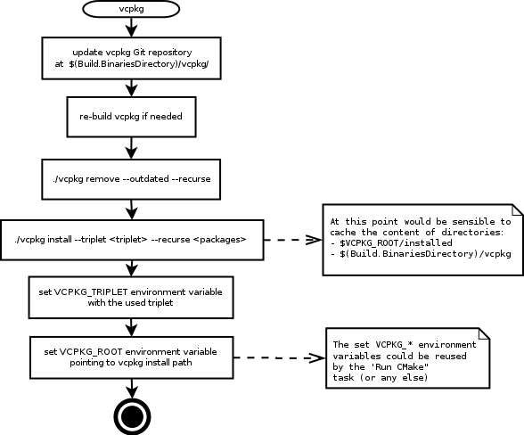
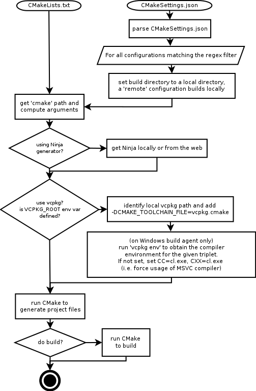

[](https://dev.azure.com/CppBuild/CppBuildTasks/_build/latest?definitionId=15&branchName=master)


# Azure DevOps [C++ build tasks](https://marketplace.visualstudio.com/items?itemName=lucappa.cmake-ninja-vcpkg-tasks) for [CMake](https://www.cmake.org/) and [vcpkg](https://github.com/microsoft/vcpkg/)

 ## User Manual
 * [Introduction](#intro)
 * [Quickstart](#quickstart)
 * [The <strong>run-vpkg</strong> task](#run-vcpkg)      
   * [Use vcpkg as a submodule of your Git repository](#use-vcpkg-as-a-submodule-of-your-git-repository)
   * [Use vcpkg's response file as parameter](#use-vcpkgs-response-file-as-parameter)
   * [Caching vcpkg's artifacts](#caching-vcpkgs-artifacts)
   * [The **'run-vcpkg'** flowchart](#the-run-vcpkg-flowchart)
 * [The <strong>run-cmake</strong> task](#run-cmake)
   * [The **'run-cmake'** flowchart](#the-run-cmake-flowchart)
 * [Tasks reference: all input parameters](#reference)
 * [Samples](#samples)
 * [Real world project samples](#realworldprojects)
 * [Q&As](#faqs)

 ## Developer Manual
 * [Developers information](#developers-information)
   * [Prerequisites](#prerequisites)
   * [Packaging](#packaging)
   * [Testing](#testing)
     * [Run a test with its javascript file](#run-a-test-with-its-javascript-file)
     * [Run a test with its typescript file](#run-a-test-with-its-typescript-file)
     * [Run a specific test](#run-a-specific-test)
  * [Contributing](#contributing)
  * [License](#license)

## <a id='intro'>Introduction</a>

Build C++ software with vcpkg and [CMake](https://www.cmake.org) (either with CMakeLists.txt or [CMakeSettings.json](https://docs.microsoft.com/en-us/cpp/build/cmakesettings-reference?view=vs-2019)). Samples provided use both [self-hosted](https://docs.microsoft.com/en-us/azure/devops/pipelines/agents/v2-windows?view=azure-devops) or [Microsoft hosted agent](https://docs.microsoft.com/en-us/azure/devops/pipelines/agents/hosted?view=azure-devops), using [Docker](https://www.docker.com/) and [Pipeline Caching](https://docs.microsoft.com/en-us/azure/devops/pipelines/caching/?view=azure-devops) as well.

## <a id='quickstart'>Quickstart</a>
 
It is highly recommended to use __vcpkg as a Git submodule__. Here below the sample where vcpkg is a Git submodule:

```yaml
  # Sample when vcpkg is a submodule

    # Cache/Restore the vcpkg's build artifacts.
  - task: Cache@2
    displayName: 'Cache vcpkg's  artifacts'
    inputs:
      # As 'key' use the content of the response file, vcpkg's submodule fetched commit id and the platform name.
      # The key must be one liner, each segment separated by pipe char, non-path segments enclosed by
      # double quotes.
      key: $(Build.SourcesDirectory)/vcpkg_x64-linux.txt | "$(Build.SourcesDirectory)/.git/modules/vcpkg/HEAD" | "$(Agent.OS)"
      path: '$(Build.SourcesDirectory)/vcpkg'
   
   - task: run-vcpkg@0
     displayName: 'Run vcpkg'
     inputs:
       # Response file stored in source control, it provides the list of ports and triplet(s).
       vcpkgArguments: @$(Build.SourcesDirectory)/vcpkg_x64-linux.txt
       # Location of the vcpkg as submodule of the repository.
       vcpkgDirectory: $(Build.SourcesDirectory)/vcpkg

   - task: run-cmake@0
     displayName: 'Run CMake with CMakeSettings.json'
     inputs:
       cmakeListsOrSettingsJson: 'CMakeSettingsJson'
       # Use the vcpkg's toolchain file for CMake.
       useVcpkgToolchainFile: true
       # Build all configurations whose name starts with "Linux".
       configurationRegexFilter: 'Linux.*'

```

Another sample when vcpkg is NOT a submodule (not recommended):


```yaml
  # Sample when vcpkg is NOT a submodule. The exact commit id to be fetched needs
  # to be explicitly provided then (i.e. the value of vcpkgGitRef in this sample).

  variables:
    # Exact vcpkg's version to fetch, commig id or tag name.
    vcpkgGitRef: 5a3b46e9e2d1aa753917246c2801e50aaabbbccc

    # Cache/restore the vcpkg's build artifacts.
  - task: Cache@2
    displayName: 'Cache vcpkg's artifacts'
    inputs:
      key: $(Build.SourcesDirectory)/vcpkg_x64-linux.txt | "$(vcpkgGitRef)" | "$(Agent.OS)"
      path: '$(Build.BinariesDirectory)/vcpkg'
   
   - task: run-vcpkg@0
     displayName: 'Run vcpkg'
     inputs:
       vcpkgArguments: @$(Build.SourcesDirectory)/vcpkg_x64-linux.txt
       # Specify the exact commit id to fetch.
       vcpkgGitCommitId: $(vcpkgGitRef)
       # URL to fetch vcpkg from (default is the official one).
       vcpkgGitURL: http://my.vcpkg.fork.git/

   - task: run-cmake@0
     displayName: 'Run CMake with CMakeSettings.json'
     inputs:
       cmakeListsOrSettingsJson: 'CMakeSettingsJson'
       useVcpkgToolchainFile: true
       # Build all configurations whose name starts with "Linux".
       configurationRegexFilter: 'Linux.*'

```

## <a id='run-vcpkg'>The ***run-vcpkg*** task</a>

The task completes the following steps:

  1. checks whether vcpkg is already located at the path specified by `vcpkgDirectory` (e.g. vcpkg could be a submodule of the Git repository checked out along with the parent repository);
  1. if vcpkg is not there, it uses [Git](https://git-scm.com/) to fetch [vcpkg](https://github.com/microsoft/vcpkg) into that directory;
  1. if needed vcpkg is built;
  1. eventually vcpkg is launched to build and install the specified ports.

The task sets `VCPKG_ROOT` task variable, which is automatically used by subsequent **'run-cmake'** to consume the vcpkg's toolchain file.

_Note:_ `VCPKG_ROOT` is set by the task by the first of these conditions:
  1. the `vcpkgArguments` input task contains the `--triplet` argument;
  1. the vcpkg's reponse file contains the `--triplet` argument;
  1. `vcpkgTriplet` input task is set to a value.
  
  In these cases, the first hit determines the content of the `VCPKG_ROOT` variable. 
  In all other cases the variable is NOT set, and any `run-cmake` task instance is not able to reuse vcpkg's toolchain path nor the triplet.

### Use **vcpkg** as a submodule of your Git repository ###

When using this **vcpkg**, be aware of how it works, specifically:
 - a specific version of vcpkg must be used either locally and on build servers;
 - a specific version of vcpkg is identified by the commit id or tag (e.g. release tag `2019.07`) of the used vcpkg repository;
 - it not possible to choose which version of the port to install, instead it is the used version of vcpkg that establishes which version of the port is available;
 
 To sum up, to keep a consistent development experience between local and remote build environments, **it is highly suggested to use vcpkg as submodule of your Git repository**; this way the version of vcpkg used is implied by the commit id specified by the submodule for vcpkg.

### Use vcpkg's response file as parameter

vcpkg accepts a response file that contains its arguments. It is useful to store under source control a text file containing the list of ports to be installed. This helps to run the vcpkg the same exact way locally and on the build servers. For example if you want to run:

 > vcpkg install boost zlib:x64 libmodbus --triplet x64

it is instead possible to run

 > vcpkg install @response_file.txt

 where `response_file.txt` contains (with no trailing whitespaces allowed):

```yaml
   boost
   zlib:x64
   libmodbus
   --triplet
   x64
```

### Caching vcpkg's artifacts

To minimize build time, the [Cache task](https://docs.microsoft.com/en-us/azure/devops/pipelines/caching/?view=azure-devops) should be used to cache the entire vcpkg's directory (which is specified by `vcpkgDirectory` of **'run-vcpkg'** task).

_Note:_ since only the `installed` subdirectory and the `vcpkg` executable file should be cached, everything but those are excluded by the `.artifactignore` file generated by the *vcpkg-run* task.

The `key` provided to the [Cache task](https://docs.microsoft.com/en-us/azure/devops/pipelines/caching/?view=azure-devops) must uniquely identify the following:
  - the vcpkg version, which identifies also all the provided ports and their specific version;
  - the used triplet and the list of ports to be built and installed;
  - the platform and the toolset used when building ports;

The following sample [key](https://docs.microsoft.com/en-us/azure/devops/pipelines/caching/?view=azure-devops#task-configuration) should grant most of the above:

```yaml
key:  $(vcpkgCommitId)| @$(Build.SourcesDirectory)/response_file_with_ports_and_triplet.txt | "$(Agent.OS)"
```
where:
  - the `$(vcpkgCommitId)` identifies a specific version of vcpkg by means of a Git commit id or tag. It is suggested to use vcpkg as a submodule of your repository, at the root for example, in such case the commit id is stored in file `$(Build.SourcesDirectory)/.git/modules/vcpkg/HEAD`. Note that a branch name should not be used, as it does not  identify uniquely the version of vcpkg;
  - the response file contains the list of ports along with the triplet, e.g.  `sqlite3 --triplet x64-linux` or another identical example `sqlite3:x64-windows`. 
  
    The `--triplet` argument specifies the default value when a port has not the triplet specified.
  
  - `$(Agent.OS)` captures only the build agent platform. If needed, it might be useful to add further values in the key to uniquely identifies the toolset used when building.

_Note:_ the key must be a one liner, it could be divided in segments with the pipe character, each non-file-path segment must be enclosed with double quotes. [As documented](https://docs.microsoft.com/en-us/azure/devops/pipelines/caching/?view=azure-devops#key-input), for file-path segments a hash value is computed, while the non-file-path segment values are used as is.

### The **'run-vcpkg'** flowchart

>  


## <a id='run-cmake'>The ***run-cmake*** task</a>

The **'run-cmake'** task works with CMakeLists.txt and [CMakeSettings.json](https://docs.microsoft.com/en-us/cpp/build/cmakesettings-reference?view=vs-2019).
It can leverage the previous execution of the **'run-vcpkg'** task by using the `VCPKG_ROOT`  task variable to:

  - set the vcpkg's toolchain file if requested, located at `$VCPKG_ROOT/scripts/buildsystems/vcpkg.cmake`;
  - set the environment for the provided triplet when building with [msvc](https://docs.microsoft.com/en-us/cpp/build/reference/c-cpp-building-reference?view=vs-2019) on Windows (i.e. building in the environment created by launching `$VCPKG_ROOT/vcpkg env`); 

### The **'run-cmake'** flowchart

The flowchart has two entry points as it could be used with a `CMakeLists.txt` or with a `CMakeSettings.json` file.

_Note:_ The task does not use th e `CMakeSettings.json`'s attribute called `inheritEnvironments`. Instead the triplet set by **'run-vcpkg'** is used by the task to set up the environment variables where the commands are run. This is only useful when using MSVC, where the environment needs to set up for setting the right target (e.g. x86 or x64 or arm).

_Note:_ The task ignores the `buildRoot` value specified in the CMakeSettings.json . It is possible to specify the CMake binary directory using the `buildDirectory` input parameter, which by default it is `$(Build.ArtifactStagingDirectory)/<configuration name>` .

>  

### <a id='reference'>Tasks reference: all input parameters</a>

A complete [reference](reference.md) of all the inputs of the tasks is provided.

## <a id="samples">Samples</a>
|CMakeLists.txt samples | |
|----------|-------|
[macOS](https://dev.azure.com/CppBuild/CppBuildTasks/_git/CppBuildTasks-Validation?path=%2Fcmakelists.txt%2Fmacos-hosted-basic.yml&version=GBmaster)| [](https://dev.azure.com/CppBuild/CppBuildTasks/_build/latest?definitionId=9&branchName=master)
[macOS with cache](https://dev.azure.com/CppBuild/CppBuildTasks/_git/CppBuildTasks-Validation?path=%2Fcmakelists.txt%2Fmacos-hosted-basic-cache.yml&version=GBmaster)|[](https://dev.azure.com/CppBuild/CppBuildTasks/_build/latest?definitionId=17&branchName=master)
[macOS with cache, vcpkg submodule](https://dev.azure.com/CppBuild/CppBuildTasks/_git/CppBuildTasks-Validation?path=%2Fcmakelists.txt%2Fmacos-hosted-basic-cache-submod_vcpkg.yml&version=master) | [](https://dev.azure.com/CppBuild/CppBuildTasks/_build/latest?definitionId=27&branchName=master)
[Windows - vs2019](https://dev.azure.com/CppBuild/CppBuildTasks/_git/CppBuildTasks-Validation?path=%2Fcmakelists.txt%2Fvs2019-hosted-basic.yml&version=GBmaster) | [](https://dev.azure.com/CppBuild/CppBuildTasks/_build/latest?definitionId=1&branchName=master)
[Windows - vs2019 with cache](https://dev.azure.com/CppBuild/CppBuildTasks/_git/CppBuildTasks-Validation?path=%2Fcmakelists.txt%2Fvs2019-hosted-basic-cache.yml&version=GBmaster) | [](https://dev.azure.com/CppBuild/CppBuildTasks/_build/latest?definitionId=19&branchName=master)
[Windows - vs2019 with cache, vcpkg submodule](https://dev.azure.com/CppBuild/CppBuildTasks/_git/CppBuildTasks-Validation?path=%2Fcmakelists.txt%2Fvs2019-hosted-basic-cache-submod_vcpkg.yml&version=GBmaster) | [](https://dev.azure.com/CppBuild/CppBuildTasks/_build/latest?definitionId=29&branchName=master)
[Windows - vs2017](https://dev.azure.com/CppBuild/CppBuildTasks/_git/CppBuildTasks-Validation?path=%2Fcmakelists.txt%2Fvs2017-hosted-basic.yml&version=GBmaster) | [](https://dev.azure.com/CppBuild/CppBuildTasks/_build/latest?definitionId=14&branchName=master)
[Windows - vs2017 with cache](https://dev.azure.com/CppBuild/CppBuildTasks/_git/CppBuildTasks-Validation?path=%2Fcmakelists.txt%2Fvs2017-hosted-basic-cache.yml&version=GBmaster) | [](https://dev.azure.com/CppBuild/CppBuildTasks/_build/latest?definitionId=20&branchName=master)
[Windows - vs2017 with cache, vcpkg submodule](https://dev.azure.com/CppBuild/CppBuildTasks/_git/CppBuildTasks-Validation?path=%2Fcmakelists.txt%2Fvs2017-hosted-basic-cache.yml&version=GBmaster) | [](https://dev.azure.com/CppBuild/CppBuildTasks/_build/latest?definitionId=28&branchName=master)
[Linux/Ubuntu](https://dev.azure.com/CppBuild/CppBuildTasks/_git/CppBuildTasks-Validation?path=%2Fcmakelists.txt%2Fubuntu-hosted-basic.yml&version=GBmaster) | [](https://dev.azure.com/CppBuild/CppBuildTasks/_build/latest?definitionId=4&branchName=master)
[Linux/Ubuntu with cache](https://dev.azure.com/CppBuild/CppBuildTasks/_git/CppBuildTasks-Validation?path=%2Fcmakelists.txt%2Fubuntu-hosted-basic-cache.yml&version=GBmaster) | [](https://dev.azure.com/CppBuild/CppBuildTasks/_build/latest?definitionId=18&branchName=master)
[Linux/Ubuntu with cache, vcpkg submodule](https://dev.azure.com/CppBuild/CppBuildTasks/_git/CppBuildTasks-Validation?path=%2Fcmakelists.txt%2Fubuntu-hosted-basic-cache-submod_vcpkg.yml&version=GBmaster) | [](https://dev.azure.com/CppBuild/CppBuildTasks/_build/latest?definitionId=27&branchName=master)

CMakeSettings.json samples |  |
|----------|-------|
[macOS](https://dev.azure.com/CppBuild/CppBuildTasks/_git/CppBuildTasks-Validation?path=%2Fcmakesettings.json%2Fmacos-hosted-advanced.yml&version=GBmaster) | [](https://dev.azure.com/CppBuild/CppBuildTasks/_build/latest?definitionId=10&branchName=master)
[macOS with cache](https://dev.azure.com/CppBuild/CppBuildTasks/_git/CppBuildTasks-Validation?path=%2Fcmakesettings.json%2Fmacos-hosted-advanced-cache.yml&version=GBmaster) | [](https://dev.azure.com/CppBuild/CppBuildTasks/_build/latest?definitionId=24&branchName=master)
[macOS with cache, vcpkg submodule](https://dev.azure.com/CppBuild/CppBuildTasks/_git/CppBuildTasks-Validation?path=%2Fcmakesettings.json%2Fmacos-hosted-advanced-cache-submod_vcpkg.yml&version=GBmaster) | [](https://dev.azure.com/CppBuild/CppBuildTasks/_build/latest?definitionId=30&branchName=master)
[Windows - vs2019](https://dev.azure.com/CppBuild/CppBuildTasks/_git/CppBuildTasks-Validation?path=%2Fcmakesettings.json%2Fvs2019-hosted-advanced.yml&version=GBmaster) | [](https://dev.azure.com/CppBuild/CppBuildTasks/_build/latest?definitionId=2&branchName=master)
[Windows - vs2019 with cache](https://dev.azure.com/CppBuild/CppBuildTasks/_git/CppBuildTasks-Validation?path=%2Fcmakesettings.json%2Fvs2019-hosted-advanced-cache.yml&version=GBmaster) | [](https://dev.azure.com/CppBuild/CppBuildTasks/_build/latest?definitionId=25&branchName=master)
[Windows - vs2019 with cache, vcpkg submodule](https://dev.azure.com/CppBuild/CppBuildTasks/_git/CppBuildTasks-Validation?path=%2Fcmakesettings.json%2Fvs2019-hosted-advanced-cache-vcpkg_submod.yml&version=GBmaster) | [](https://dev.azure.com/CppBuild/CppBuildTasks/_build/latest?definitionId=32&branchName=master)
[Windows - vs2017](https://dev.azure.com/CppBuild/CppBuildTasks/_git/CppBuildTasks-Validation?path=%2Fcmakesettings.json%2Fvs2017-hosted-advanced.yml&version=GBmaster) | [](https://dev.azure.com/CppBuild/CppBuildTasks/_build/latest?definitionId=13&branchName=master)
[Windows - vs2017 with cache](https://dev.azure.com/CppBuild/CppBuildTasks/_git/CppBuildTasks-Validation?path=%2Fcmakesettings.json%2Fvs2017-hosted-advanced-cache.yml&version=GBmaster) | [](https://dev.azure.com/CppBuild/CppBuildTasks/_build/latest?definitionId=22&branchName=master)
[Windows - vs2017 with cache, vcpkg submodule](https://dev.azure.com/CppBuild/CppBuildTasks/_git/CppBuildTasks-Validation?path=%2Fcmakesettings.json%2Fvs2017-hosted-advanced-cache.yml&version=GBmaster) | N/A
[Linux/Ubuntu](https://dev.azure.com/CppBuild/CppBuildTasks/_git/CppBuildTasks-Validation?path=%2Fcmakesettings.json%2Fubuntu-hosted-advanced.yml&version=GBmaster) | [](https://dev.azure.com/CppBuild/CppBuildTasks/_build/latest?definitionId=3&branchName=master)
[Linux/Ubuntu with cache](https://dev.azure.com/CppBuild/CppBuildTasks/_git/CppBuildTasks-Validation?path=%2Fcmakesettings.json%2Fubuntu-hosted-advanced-cache.yml&version=GBmaster) | [](https://dev.azure.com/CppBuild/CppBuildTasks/_build/latest?definitionId=23&branchName=master)
[Linux/Ubuntu with cache, vcpkg submodule](https://dev.azure.com/CppBuild/CppBuildTasks/_git/CppBuildTasks-Validation?path=%2Fcmakesettings.json%2Fubuntu-hosted-advanced-cache-submod_vcpkg.yml&version=GBmaster) | [](https://dev.azure.com/CppBuild/CppBuildTasks/_build/latest?definitionId=31&branchName=master)

## <a id='realworldprojects'>Real world project samples</a>

project: [Microsoft MSVC STL](https://github.com/microsoft/STL) | |
|----------|-------|
[MSVC STL with cache, vcpkg submodule](https://github.com/microsoft/STL/blob/master/azure-devops/run_build.yml) | [](https://dev.azure.com/vclibs/STL/_build/latest?definitionId=2&branchName=master)


project: [Microsoft MSVC STL (fork)](https://github.com/lukka/STL) | |
|----------|-------|
[MSVC STL with cache, vcpkg submodule, self hosted agent Docker based](https://github.com/lukka/STL/blob/master/azure-devops/run_build.yml) |  [](https://dev.azure.com/CppBuild/CppBuildTasks/_build/latest?definitionId=36&branchName=master)
[MSVC STL with cache, vcpkg submodule, MS hosted agent Docker based](https://github.com/lukka/STL/blob/master/azure-devops/run_build.yml) |  [](https://dev.azure.com/CppBuild/CppBuildTasks/_build/latest?definitionId=37&branchName=master)

project: [Microsoft cpprestsdk](https://github.com/microsoft/cpprestsdk) | |
|----------|-------|
[macOS](https://github.com/lukka/cpprestsdk/blob/master/pipeline-macos-hosted.yml) | [](https://dev.azure.com/CppBuild/CppBuildTasks/_build/latest?definitionId=11&branchName=master)
[Linux/Ubuntu](https://github.com/lukka/cpprestsdk/blob/master/pipeline-ubuntu-hosted.yml) | [](https://dev.azure.com/CppBuild/CppBuildTasks/_build/latest?definitionId=6&branchName=master)
[vs2017](https://github.com/lukka/cpprestsdk/blob/master/pipeline-vs2017-hosted.yml) | [](https://dev.azure.com/CppBuild/CppBuildTasks/_build/latest?definitionId=7&branchName=master)
[vs2019](https://github.com/lukka/cpprestsdk/blob/master/pipeline-vs2019-hosted.yml) | [](https://dev.azure.com/CppBuild/CppBuildTasks/_build/latest?definitionId=12&branchName=master)

project: [vct](https://github.com/sfreed141/vct) ||
|----------|-------|
[macOS/Linux/Windows](https://github.com/lukka/vct/blob/master/azure-pipeline-hosted.yml) | [](https://dev.azure.com/CppBuild/CppBuildTasks/_build/latest?definitionId=5&branchName=ci-build)

project: [CppOpenGLWebAssemblyCMake](https://github.com/lukka/CppOpenGLWebAssemblyCMake) | |
|----------|-------|
[webassembly(with Docker)/Linux/macOS/Windows](https://github.com/lukka/CppOpenGLWebAssemblyCMake/blob/master/azure-pipelines.yml) | [](https://dev.azure.com/CppBuild/CppBuildTasks/_build/latest?definitionId=8&branchName=master)

## <a id='faqs'>Questions and Answers</a>

### Why not one single task?

Because you could use vcpkg without CMake. Or you could use CMake without vcpkg.

### Would creating an ad-hoc bash/powershell script be easier?

Absolutely! Anyone can use this task as an inspiration for writing their own scripts to suite specific needs.
The purpose of the tasks is to streamline and to simplify the usage of vcpkg and CMake on build servers.

### Why the **'run-vcpkg'** task runs vcpkg in any case, even when cached port files are restored?

Indeed it is not needed to run vcpkg when the cache is being restored, and you could use [Cache task](https://docs.microsoft.com/en-us/azure/devops/pipelines/caching/?view=azure-devops)'s  `cacheHitVar` parameter to control the execution of the **'run-vcpkg'** task. Currently **'run-vcpkg'** task defensively runs vcpkg as a sanity check: it should output in the build log that all the requested ports are installed already, spending a neglibile amount of time.


# Developers information

## Prerequisites
[gulp 4](https://www.npmjs.com/package/gulp4) and [tfx-cli 0.6+](https://www.npmjs.com/package/tfx-cli) globally installed.

## Packaging 
To package the extension for release purpose, run:
  
  > npm run pack

or to pack it for development purpose:

  > export MAJOR=0 \
  > export MINOR=9 \
  > npm run packdev 

`MAJOR` and `MINOR` environment variables are used to set the version of extension and tasks. Note that the path is bumped automatically at each run.
Using 'packdev', GUIDs of extension and tasks are changed so the extension could be
uploaded and tested on Azure DevOps without interfering with the already released tasks.
The name of the tasks have appended "-dev" to distringuish them from the already released ones.

## Testing
Run the whole test suite:

  > npm run test

or to have full output on stdout:

  > npm run testdev

### Run a test with its javascript file 
 It is possible to debug a single test with:
  
  > /usr/local/bin/node --inspect-brk task-cmake/build/tests/success-cmakesettings.js

and then debug in chrome's nodejsdevtools.

Or just use:

 > npm run test -- -g testname --inspect-brk

### Run a test with its typescript file
 It is possible to use 'mocha' to start a single test case to debug with Chrome's nodejs development tools:

  > mocha --inspect-brk --require ts-node/register task-vcpkg/tests/_suite.ts

 If breakpoints are not hit in the Chrome debugger, launch directly the .js file:

  > mocha --inspect-brk build/task-cmake/tests/success-cmakesettings-complex.js


### Run a specific test
To run all tests that contains "toolchain" in the name:

  > npm run testdev -- -g toolchain

## <a id='contributing'>Contributing</a>

The software is provided as is, there is no warranty of any kind. All users are encouraged to get the [source code](https://github.com/lukka/CppBuildTasks) and improve the tasks with fixes and new features. 

# License
All the content in this repository, of the extension and of the 'run-cmake' and 'run-vcpkg' tasks are licensed under the [MIT License](LICENSE.txt).

Copyright (c) 2019 Luca Cappa
